# 交易决策中心技术方案设计

## 1. 文档目标与范围

### 1.1 目标

本文用于为“关注股票列表”及其子页面提供一套完整、可落地的技术方案，指导后续在当前 Flask 项目中实现真实业务能力。方案覆盖：

- 关注股票列表 `/watch-stocks` / `/index`
- 进场决策 `/entry-decision`
- 股票分析 `/stock-analysis-record`
- 持仓计划分析 `/trade-plan-analysis`
- 上述页面在关注股票域内的相关历史记录查询与展示

本文重点输出以下内容：

- 总体架构设计
- 分层与类设计
- 数据库表结构设计
- 状态机设计
- 核心业务逻辑设计
- API 接口设计
- 异步任务与 SSE 设计
- Mermaid 时序图设计
- 实施顺序与测试建议

### 1.2 设计依据

业务设计来源：

- `doc/trading_decision_online_plan.md`

UI 设计来源：

- `doc/ui/watch_stocks_page.html`
- `doc/ui/entry_decision_page.html`
- `doc/ui/stock_analysis_page.html`
- `doc/ui/trade_plan_analysis_page.html`
- `doc/ui/README.md`

当前技术实现参考：

- `src/stock_analyse/interfaces/web/app.py`
- `src/stock_analyse/interfaces/web/routes/misc.py`
- `src/stock_analyse/interfaces/web/routes/analysis.py`
- `src/stock_analyse/interfaces/web/services/stock_analyzer_service.py`
- `static/ui/nav.js`

### 1.3 本文范围内 / 范围外

本文范围内：

- 关注股票域（watch-stocks）完整业务闭环的技术设计
- 基于当前 Flask 架构的实现方式
- 当前 UI 原型对应的真实业务落地方案

本文范围外：

- 持仓股票列表的完整实现细节
- 组合复盘 / Portfolio Review 的完整实现
- 多用户组织权限体系
- 全量前端框架迁移（如 Vue/React 重构）

---

## 2. 现状与设计约束

## 2.1 当前项目现状

当前 Web 应用由 Flask 提供，入口在：

- `src/stock_analyse/interfaces/web/app.py`

当前已有真实能力主要集中在：

1. 选股能力
2. 单股分析能力
3. AI 个股分析能力
4. SSE 推送能力
5. 历史记录查询能力

对应关键模块：

- `src/stock_analyse/interfaces/web/routes/analysis.py`
- `src/stock_analyse/interfaces/web/services/stock_analyzer_service.py`

而“关注股票列表及其子页面”目前仍主要是静态 UI 原型：

- `src/stock_analyse/interfaces/web/routes/misc.py` 中相关路由仍通过 `send_file(...)` 返回 `doc/ui/*.html`

例如：

- `/watch-stocks` / `/index`
- `/entry-decision`
- `/stock-analysis-record`
- `/trade-plan-analysis`

这些页面已具备：

- 信息结构
- 页面布局
- 按钮与页面间跳转关系
- 页面所需数据块定义

但尚未具备：

- 后端真实 CRUD
- 结构化业务状态机
- 结构化业务数据库
- 当前状态与历史动作记录的持久化模型
- 统一 API 设计

## 2.2 现有可复用能力

当前项目可以直接复用的能力包括：

### 2.2.1 Flask App 与上下文能力

`src/stock_analyse/interfaces/web/app.py` 中的 `WebAppContext` 已提供：

- `settings`
- `SSEManager`
- `StockAnalyzerService`
- `ThreadPoolExecutor`
- `analysis_tasks`

这些能力可直接复用于交易决策域的：

- 异步任务调度
- SSE 推送
- 配置读取

### 2.2.2 股票分析能力

`src/stock_analyse/interfaces/web/services/stock_analyzer_service.py` 已提供：

- `stock_analysis_process(...)`
- `stock_select_process(...)`
- 现有 AI 分析 orchestration
- 历史分析结果查询能力

该服务适合作为“分析执行能力”的底层依赖，但不应直接承载 watch-stocks 的业务状态管理。

### 2.2.3 SSE 流式推送能力

当前 `analysis.py` 中已具备：

- `/api/sse`
- SSE 连接生命周期管理
- 线程池后台运行 + 事件推送模式

这套机制可直接复用到：

- AI 预填建议
- 股票分析记录生成
- 持仓计划分析生成

## 2.3 当前缺失能力

对于 watch-stocks 业务域，当前项目仍缺少：

1. 关注股票主实体及 CRUD
2. 进场决策结构化实体与持久化
3. 股票分析记录结构化实体与持久化
4. 持仓计划分析结构化实体与持久化
5. AI 预填过程的审计落库
6. 决策卡快照实体与不可变存档
7. watch-stocks 的统一历史记录查询模型
8. 领域状态机与规则约束

## 2.4 设计约束

本方案必须满足以下约束：

1. 保持当前 Flask 项目结构，不进行框架迁移
2. 复用现有分析服务与 SSE 基础设施
3. 新增结构化业务层，不把业务逻辑继续堆叠在 `misc.py` / `analysis.py` 中
4. 优先使用 SQLite 作为交易决策域的事务型主存储
5. 主列表展示“当前摘要”，历史记录展示“动作事实”

---

## 3. 总体架构设计

## 3.1 总体设计原则

推荐将“交易决策中心”作为当前项目中的一个新的业务子域：

- 不修改现有分析域的职责边界
- 在现有 Flask 架构之上新增 `trading_decision` 业务层
- 将业务状态、当前摘要、历史记录与 AI 原始结果分层存储

核心设计原则：

1. **WatchStock 作为主聚合根**
2. **每个动作按钮都生成一条独立业务记录**
3. **主列表保存当前摘要，子记录保存历史事实**
4. **AI 分析输出通过适配层映射到业务模型**
5. **长耗时分析动作走异步 + SSE，普通 CRUD 走同步**

## 3.2 推荐模块布局

```text
src/stock_analyse/
  application/
    dto/
      trading_decision/
        watch_stock_dto.py
        decision_case_dto.py
        stock_analysis_record_dto.py
        trade_plan_analysis_record_dto.py
        history_query_dto.py
    use_cases/
      trading_decision/
        create_watch_stock.py
        list_watch_stocks.py
        update_watch_stock.py
        archive_watch_stock.py
        create_decision_case.py
        prefill_decision_case_with_ai.py
        confirm_decision_case.py
        reject_decision_case.py
        create_stock_analysis_record.py
        create_trade_plan_analysis_record.py
        list_watch_records.py
        get_watch_stock_detail.py
    services/
      trading_decision/
        trading_decision_application_service.py

  domain/
    models/
      trading_decision/
        watch_stock.py
        decision_case.py
        stock_analysis_record.py
        trade_plan_analysis_record.py
        ai_prefill_record.py
        decision_case_snapshot.py
    value_objects/
      trading_decision/
        enums.py
        stage.py
        price_zone.py
        suggested_action.py
    services/
      trading_decision/
        decision_prefill_service.py
        decision_card_renderer.py
        trade_plan_analysis_assembler.py
        watch_stock_state_machine.py
        record_summary_service.py

  infrastructure/
    persistence/
      trading_decision/
        sqlite_connection.py
        schema_manager.py
        watch_stock_repository.py
        decision_case_repository.py
        stock_analysis_record_repository.py
        trade_plan_analysis_record_repository.py
        ai_prefill_record_repository.py
        decision_case_snapshot_repository.py
        watch_history_query_repository.py

  interfaces/
    web/
      routes/
        trading_decision.py
      services/
        trading_decision_service.py
```

## 3.3 分层职责说明

### 3.3.1 `interfaces/web/routes/trading_decision.py`

职责：

- 注册页面路由
- 注册 `/api/trading-decision/*` API
- 解析 HTTP 请求参数
- 返回 JSON 或页面上下文
- 控制 HTTP 状态码

不负责：

- SQL
- 状态迁移逻辑
- 业务规则判断

### 3.3.2 `interfaces/web/services/trading_decision_service.py`

职责：

- route 与 application use case 之间的桥接
- 参数装配、DTO 转换
- 页面读模型聚合
- SSE 任务启动入口编排

### 3.3.3 `application/use_cases/trading_decision/*`

职责：

- 每个文件只负责一个业务动作
- 组织 repository + domain model 调用
- 返回稳定的应用层输出 DTO

### 3.3.4 `domain/models/trading_decision/*`

职责：

- 封装状态机
- 承载不变量
- 执行领域规则校验

### 3.3.5 `infrastructure/persistence/trading_decision/*`

职责：

- SQLite 建表
- CRUD 与查询
- 列表页、历史页专用 query repository

## 3.4 架构关系图

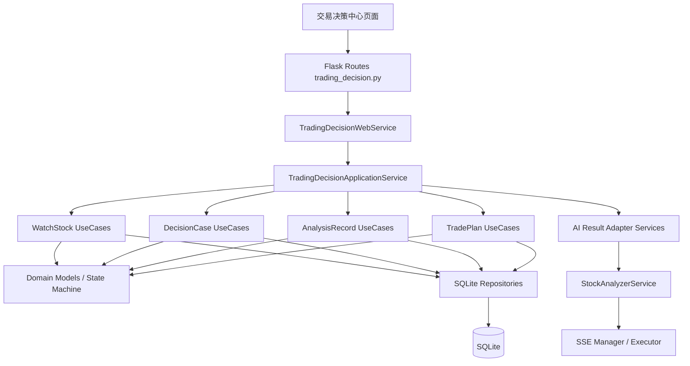

---

## 4. 页面与业务子流程设计

## 4.1 关注股票列表 `/watch-stocks`

### 页面职责

- 展示当前关注池
- 按条件筛选当前关注股票
- 提供进入子页面的动作入口
- 在页面下方展示同级历史记录列表

### 对应实体

- `WatchStock`
- `DecisionCase`
- `StockAnalysisRecord`
- `TradePlanAnalysisRecord`

### 页面数据块

1. 统计卡
2. 关注股票筛选区
3. 当前关注标的表格
4. 同级历史记录 tabs + 过滤器 + 卡片列表

### 主页面展示的是“当前摘要”

主页面不直接拼接原始 AI 输出，而是展示 `WatchStock` 当前摘要字段，例如：

- 当前阶段
- 当前价格区间
- 当前建议
- 最新结论摘要
- 最近分析时间

这些摘要字段由最近一次有效动作记录回填更新。

## 4.2 进场决策 `/entry-decision`

### 页面职责

- 承接某只关注股票的正式买前决策动作
- 支持 AI 预填建议
- 支持人工修改与保存草稿
- 支持确认形成正式决策卡
- 展示历史决策记录

### 对应实体

- `WatchStock`
- `DecisionCase`
- `AIPrefillRecord`
- `DecisionCaseSnapshot`

### 页面操作

- 生成 AI 预填建议
- 保存草稿
- 确认决策单
- 查看决策历史

## 4.3 股票分析 `/stock-analysis-record`

### 页面职责

- 发起一次结构化股票研究动作
- 记录股票分析结论
- 展示分析历史记录

### 对应实体

- `WatchStock`
- `StockAnalysisRecord`
- `AIPrefillRecord`

## 4.4 持仓计划分析 `/trade-plan-analysis`

### 页面职责

- 基于关注股票形成一份买前持仓计划草案
- 支持结构化记录仓位、分笔、风控、退出规则
- 展示历史计划分析记录

### 对应实体

- `WatchStock`
- `TradePlanAnalysisRecord`
- `AIPrefillRecord`

## 4.5 同级历史记录

### 页面职责

在 watch-stocks 主页面下展示三类同级记录：

- 进场决策记录
- 股票分析记录
- 持仓计划分析记录

### 设计原则

- 使用统一查询模型
- 支持按 `record_type` 过滤
- 支持统一分页、关键字、阶段、时间等条件筛选

---

## 5. 领域模型与类设计

## 5.1 核心实体概览

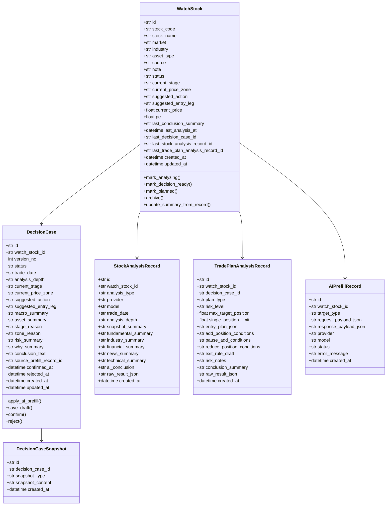

## 5.2 `WatchStock` 设计

### 角色定位

- watch-stocks 主列表中的一行
- 关注股票域的聚合根
- 保存当前摘要状态

### 核心字段

- `id`
- `stock_code`
- `stock_name`
- `market`
- `industry`
- `asset_type`
- `source`
- `note`
- `status`
- `current_price`
- `pe`
- `current_stage`
- `current_price_zone`
- `suggested_action`
- `suggested_entry_leg`
- `last_conclusion_summary`
- `last_analysis_at`
- `last_decision_case_id`
- `last_stock_analysis_record_id`
- `last_trade_plan_analysis_record_id`
- `created_at`
- `updated_at`

### 关键方法

- `mark_analyzing()`
- `mark_decision_ready()`
- `mark_planned()`
- `archive()`
- `update_summary_from_record(record)`

## 5.3 `DecisionCase` 设计

### 角色定位

- 一次正式的进场决策动作
- 支持 AI 预填 + 人工修改 + 确认
- 确认后生成决策卡快照

### 关键规则

- 允许存在多条历史决策记录
- 同一时间只允许一个未终态的活跃决策单
- 只有 `confirmed` 状态可生成正式决策卡

## 5.4 `StockAnalysisRecord` 设计

### 角色定位

- 一次结构化研究动作的留痕
- 不是当前状态源头，而是事实记录
- 可反向回填 `WatchStock` 摘要信息

## 5.5 `TradePlanAnalysisRecord` 设计

### 角色定位

- 一次买前持仓计划草案
- 保存结构化仓位、分笔和风控信息
- 与 `DecisionCase` 可选关联

## 5.6 `AIPrefillRecord` 设计

### 角色定位

- 记录 AI 调用请求与返回
- 提供可审计能力
- 支持问题排查和历史对账

## 5.7 `DecisionCaseSnapshot` 设计

### 角色定位

- 保存确认后的不可变决策卡
- 支持结构化卡片与 Markdown 卡片两种快照格式

---

## 6. 数据库与表结构设计

## 6.1 存储选型

本方案推荐：

- 使用 SQLite 作为交易决策中心的事务型主存储

原因：

1. 当前项目已有本地化和轻量部署特征
2. 业务记录强依赖事务一致性而不是高并发写入
3. 对 watch-stocks 域而言，SQLite 足以支撑当前阶段复杂度
4. 后续如需迁移到 MySQL，可保持 repository 接口不变

## 6.2 表结构设计原则

1. `watch_stocks` 存当前态
2. 动作记录存 append-only 历史
3. AI 原始结果和复杂结构保存为 JSON/TEXT
4. 常用列表筛选字段单独建列

## 6.3 表：`watch_stocks`

| 字段名 | 类型 | 说明 |
|---|---|---|
| id | TEXT PK | 关注股票 ID，如 `WS-20260425-0001` |
| stock_code | TEXT | 股票代码 |
| stock_name | TEXT | 股票名称 |
| market | TEXT | 市场 |
| industry | TEXT | 行业 |
| asset_type | TEXT | 资产类型 |
| source | TEXT | 来源 |
| note | TEXT | 用户备注 |
| status | TEXT | 当前状态 |
| current_price | REAL | 当前价格摘要 |
| pe | REAL | 当前 PE 摘要 |
| current_stage | TEXT | 当前阶段 |
| current_price_zone | TEXT | 当前价格区间 |
| suggested_action | TEXT | 当前建议动作 |
| suggested_entry_leg | TEXT | 当前建议笔次 |
| last_conclusion_summary | TEXT | 最新摘要结论 |
| last_analysis_at | TEXT | 最近分析时间 |
| last_decision_case_id | TEXT | 最近决策单 ID |
| last_stock_analysis_record_id | TEXT | 最近股票分析记录 ID |
| last_trade_plan_analysis_record_id | TEXT | 最近持仓计划分析记录 ID |
| created_at | TEXT | 创建时间 |
| updated_at | TEXT | 更新时间 |

### 索引

- `idx_watch_stocks_code(stock_code)`
- `idx_watch_stocks_status(status, updated_at DESC)`
- `idx_watch_stocks_stage_zone(current_stage, current_price_zone)`

## 6.4 表：`decision_cases`

| 字段名 | 类型 | 说明 |
|---|---|---|
| id | TEXT PK | 决策单 ID |
| watch_stock_id | TEXT FK | 关联关注股票 |
| version_no | INTEGER | 版本号 |
| status | TEXT | `draft/ai_prefilled/confirmed/rejected` |
| trade_date | TEXT | 交易日期 |
| analysis_depth | TEXT | 分析深度 |
| current_price | REAL | 当前价格 |
| current_stage | TEXT | 阶段 |
| current_price_zone | TEXT | 价格区间 |
| suggested_action | TEXT | 建议动作 |
| suggested_entry_leg | TEXT | 建议笔次 |
| macro_summary | TEXT | 宏观判断 |
| asset_summary | TEXT | 资产分类判断 |
| stage_reason | TEXT | 阶段说明 |
| zone_reason | TEXT | 区间说明 |
| risk_summary | TEXT | 风险提示 |
| why_summary | TEXT | 核心原因 |
| conclusion_text | TEXT | 一句话结论 |
| source_prefill_record_id | TEXT | 关联 AI 预填记录 |
| confirmed_at | TEXT | 确认时间 |
| rejected_at | TEXT | 拒绝时间 |
| created_at | TEXT | 创建时间 |
| updated_at | TEXT | 更新时间 |

### 索引

- `idx_decision_cases_watch_stock_id(watch_stock_id, created_at DESC)`
- `idx_decision_cases_status(status, created_at DESC)`

## 6.5 表：`stock_analysis_records`

| 字段名 | 类型 | 说明 |
|---|---|---|
| id | TEXT PK | 分析记录 ID |
| watch_stock_id | TEXT FK | 关联关注股票 |
| analysis_type | TEXT | 分析类型 |
| provider | TEXT | AI/分析来源 |
| model | TEXT | 使用模型 |
| trade_date | TEXT | 交易日期 |
| analysis_depth | TEXT | 分析深度 |
| snapshot_summary | TEXT | 摘要 |
| fundamental_summary | TEXT | 基本面摘要 |
| industry_summary | TEXT | 行业摘要 |
| financial_summary | TEXT | 财务摘要 |
| news_summary | TEXT | 新闻摘要 |
| technical_summary | TEXT | 技术面摘要 |
| ai_conclusion | TEXT | AI 综合结论 |
| raw_result_json | TEXT | 原始结果 JSON |
| created_at | TEXT | 创建时间 |

### 索引

- `idx_stock_analysis_records_watch_stock_id(watch_stock_id, created_at DESC)`

## 6.6 表：`trade_plan_analysis_records`

| 字段名 | 类型 | 说明 |
|---|---|---|
| id | TEXT PK | 计划分析记录 ID |
| watch_stock_id | TEXT FK | 关联关注股票 |
| decision_case_id | TEXT FK NULL | 可选关联决策单 |
| plan_type | TEXT | 计划类型 |
| risk_level | TEXT | 风险等级 |
| max_target_position | REAL | 最大目标仓位 |
| single_position_limit | REAL | 单笔上限 |
| entry_plan_json | TEXT | 分笔计划 JSON |
| add_position_conditions | TEXT | 补仓条件 |
| pause_add_conditions | TEXT | 暂停加仓条件 |
| reduce_position_conditions | TEXT | 减仓条件 |
| exit_rule_draft | TEXT | 卖出规则草案 |
| risk_notes | TEXT | 风险说明 |
| conclusion_summary | TEXT | 结论摘要 |
| raw_result_json | TEXT | 原始结果 JSON |
| created_at | TEXT | 创建时间 |

### 索引

- `idx_trade_plan_analysis_records_watch_stock_id(watch_stock_id, created_at DESC)`

## 6.7 表：`ai_prefill_records`

| 字段名 | 类型 | 说明 |
|---|---|---|
| id | TEXT PK | AI 预填记录 ID |
| watch_stock_id | TEXT FK | 关联关注股票 |
| target_type | TEXT | `decision_case/stock_analysis/trade_plan_analysis` |
| request_payload_json | TEXT | AI 请求参数 |
| response_payload_json | TEXT | AI 返回结果 |
| provider | TEXT | 提供方 |
| model | TEXT | 模型 |
| status | TEXT | `success/failed` |
| error_message | TEXT | 错误信息 |
| created_at | TEXT | 创建时间 |

### 索引

- `idx_ai_prefill_records_watch_stock_id(watch_stock_id, created_at DESC)`

## 6.8 表：`decision_case_snapshots`

| 字段名 | 类型 | 说明 |
|---|---|---|
| id | TEXT PK | 快照 ID |
| decision_case_id | TEXT FK | 关联决策单 |
| snapshot_type | TEXT | `structured_card/markdown_card` |
| snapshot_content | TEXT | 快照内容 |
| created_at | TEXT | 创建时间 |

### 索引

- `idx_decision_case_snapshots_case_id(decision_case_id, created_at DESC)`

## 6.9 建表关系图

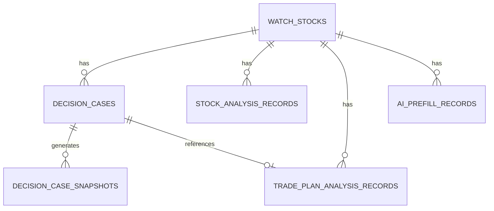

---

## 7. 状态机与状态流转设计

## 7.1 WatchStock 状态机

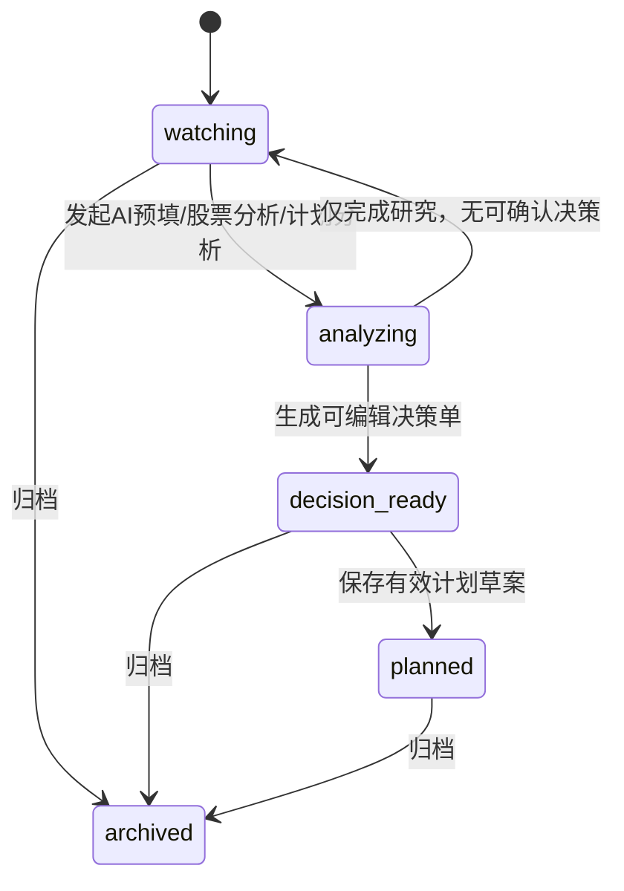

### 状态定义

- `watching`：已加入关注池，处于跟踪中
- `analyzing`：后台正在生成分析或预填结果
- `decision_ready`：已有可编辑或可确认的决策内容
- `planned`：已有可执行的持仓计划草案
- `archived`：终止关注

## 7.2 DecisionCase 状态机

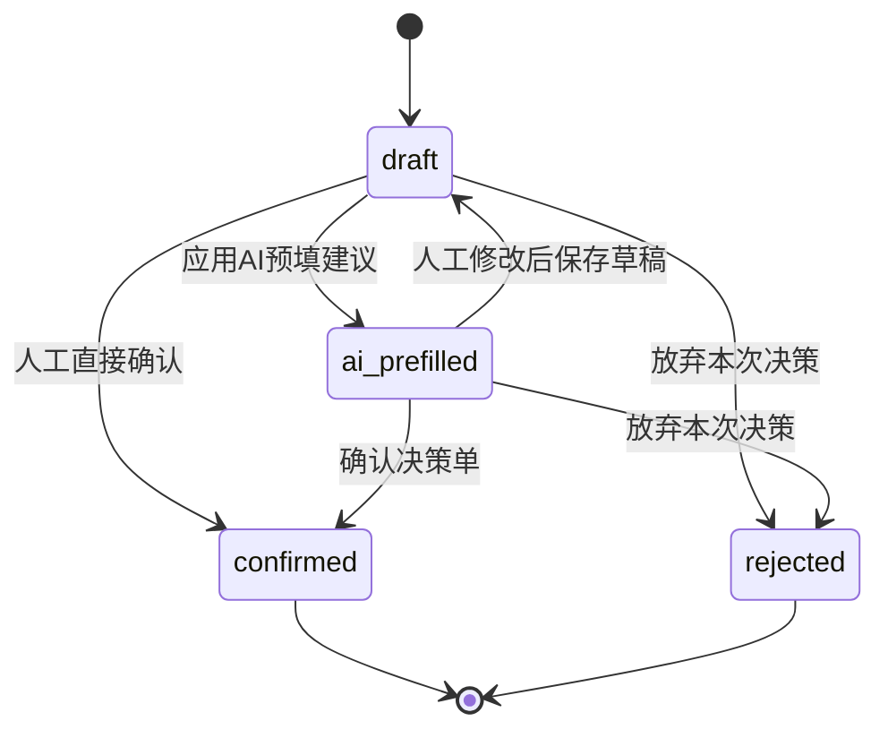

### 状态约束

- 只有 `draft` 和 `ai_prefilled` 可编辑
- 只有 `confirmed` 可生成正式决策卡快照
- `rejected` 不可再继续编辑，应新建新版本决策单

## 7.3 关键状态规则

1. 新建关注股票时，`WatchStock.status = watching`
2. 发起 AI 预填 / 股票分析 / 计划分析时，`WatchStock.status = analyzing`
3. AI 预填成功并形成可编辑决策单后，`WatchStock.status = decision_ready`
4. 计划分析保存成功后，可将 `WatchStock.status = planned`
5. 所有归档动作都通过显式 archive 接口完成

---

## 8. 核心业务逻辑设计

## 8.1 业务规则总则

1. 每个主要动作都必须产生结构化记录
2. 主列表仅展示摘要，不作为事实源
3. AI 输出必须可审计
4. 决策卡确认后不可变
5. 同一关注股票允许存在多次历史分析与多次历史决策

## 8.2 当前摘要回填规则

`WatchStock` 的摘要字段由“最新有效记录”回填：

- 最新 `DecisionCase` 回填：
  - `current_stage`
  - `current_price_zone`
  - `suggested_action`
  - `suggested_entry_leg`
  - `last_conclusion_summary`
- 最新 `StockAnalysisRecord` 回填：
  - `last_analysis_at`
  - `last_conclusion_summary`
- 最新 `TradePlanAnalysisRecord` 回填：
  - 计划摘要、风险说明、计划状态

## 8.3 AI 预填逻辑

### 输入

- `stock_code`
- `market`
- `trade_date`
- `analysis_depth`

### 执行方式

通过新服务 `DecisionPrefillService`：

1. 调用现有 `StockAnalyzerService` 的分析能力
2. 读取返回结果
3. 映射到 entry-decision 所需的业务字段
4. 生成 `AIPrefillRecord`
5. 创建或更新活跃的 `DecisionCase`
6. 更新 `WatchStock` 摘要状态

## 8.4 股票分析记录生成逻辑

1. 前端发起股票分析
2. 后端后台线程调用现有股票分析链路
3. 对分析结果进行业务归一化
4. 写入 `StockAnalysisRecord`
5. 更新 `WatchStock.last_stock_analysis_record_id` 与摘要字段

## 8.5 持仓计划分析逻辑

1. 基于关注股票当前状态和可选决策单生成一份计划草案
2. 使用 `TradePlanAnalysisAssembler` 将原始结果映射为：
   - 最大目标仓位
   - 单笔上限
   - 分笔计划
   - 补仓条件
   - 暂停条件
   - 减仓条件
   - 卖出规则
3. 写入 `TradePlanAnalysisRecord`
4. 更新 watch-stock 状态与摘要

## 8.6 决策卡生成逻辑

确认决策单时：

1. 校验 `DecisionCase.status == confirmed` 或允许从 `draft/ai_prefilled` 转确认
2. 由 `DecisionCardRenderer` 生成：
   - 结构化卡片快照
   - Markdown 卡片快照
3. 落库 `DecisionCaseSnapshot`
4. 后续页面读取 snapshot 而非动态再生成

---

## 9. API 设计

## 9.1 设计原则

统一使用命名空间：

- `/api/trading-decision/*`

统一响应结构：

### 成功

```json
{
  "success": true,
  "data": {},
  "message": "ok"
}
```

### 失败

```json
{
  "success": false,
  "error": {
    "code": "INVALID_STATE",
    "message": "Only draft or ai_prefilled decision cases can be confirmed."
  }
}
```

## 9.2 WatchStock APIs

### `GET /api/trading-decision/watch-stocks`

用途：查询主列表

查询参数：

- `status`
- `market`
- `asset_type`
- `stage`
- `price_zone`
- `keyword`
- `page`
- `page_size`

响应示例：

```json
{
  "success": true,
  "data": {
    "items": [
      {
        "id": "WS-20260425-0001",
        "stock_code": "300750",
        "stock_name": "宁德时代",
        "market": "CN",
        "current_stage": "B",
        "current_price_zone": "合理偏低区",
        "suggested_action": "适合买第一笔",
        "last_conclusion_summary": "行业景气仍在，估值回落后性价比改善。"
      }
    ],
    "summary": {
      "watch_count": 28,
      "decision_ready_count": 9,
      "analysis_completed_count": 17,
      "planned_count": 6
    },
    "pagination": {
      "page": 1,
      "page_size": 20,
      "total": 28
    }
  },
  "message": "ok"
}
```

### `POST /api/trading-decision/watch-stocks`

用途：新增关注股票

请求体：

```json
{
  "stock_code": "300750",
  "stock_name": "宁德时代",
  "market": "CN",
  "industry": "新能源车",
  "asset_type": "成长型",
  "source": "手工新增",
  "note": "观察回撤后的第一笔机会"
}
```

### `GET /api/trading-decision/watch-stocks/<id>`

用途：查看详情与最近记录摘要

### `PUT /api/trading-decision/watch-stocks/<id>`

用途：更新基础信息与备注

### `POST /api/trading-decision/watch-stocks/<id>/archive`

用途：归档关注股票

## 9.3 Entry Decision APIs

### `POST /api/trading-decision/watch-stocks/<id>/entry-decision/ai-prefill`

用途：发起 AI 预填建议

请求体：

```json
{
  "trade_date": "2026-04-25",
  "analysis_depth": "standard",
  "client_id": "client_123"
}
```

响应：

```json
{
  "success": true,
  "data": {
    "task_mode": "async",
    "client_id": "client_123",
    "watch_stock_id": "WS-20260425-0001",
    "target_type": "decision_case"
  },
  "message": "ai prefill started"
}
```

### `POST /api/trading-decision/decision-cases`

用途：创建决策单草稿

### `GET /api/trading-decision/decision-cases/<id>`

用途：查询决策单详情

### `PUT /api/trading-decision/decision-cases/<id>`

用途：保存草稿修改

### `POST /api/trading-decision/decision-cases/<id>/confirm`

用途：确认决策单并生成决策卡

### `POST /api/trading-decision/decision-cases/<id>/reject`

用途：放弃本次决策

### `GET /api/trading-decision/decision-cases/<id>/card`

用途：获取结构化卡与 Markdown 卡

## 9.4 Stock Analysis APIs

### `POST /api/trading-decision/watch-stocks/<id>/stock-analysis/run`

用途：发起股票分析异步任务

### `POST /api/trading-decision/stock-analysis-records`

用途：保存结构化股票分析记录

### `GET /api/trading-decision/stock-analysis-records`

用途：查询股票分析历史

查询条件：

- `watch_stock_id`
- `stock_code`
- `analysis_type`
- `provider`
- `model`
- `date_from`
- `date_to`

### `GET /api/trading-decision/stock-analysis-records/<id>`

用途：查询单条详情

## 9.5 Trade Plan Analysis APIs

### `POST /api/trading-decision/watch-stocks/<id>/trade-plan-analysis/run`

用途：发起持仓计划分析异步任务

### `POST /api/trading-decision/trade-plan-analysis-records`

用途：保存计划分析记录

### `GET /api/trading-decision/trade-plan-analysis-records`

用途：查询计划分析历史

### `GET /api/trading-decision/trade-plan-analysis-records/<id>`

用途：查询详情

## 9.6 Related History APIs

### `GET /api/trading-decision/watch-stocks/<id>/related-records`

用途：返回某个关注股票相关的最新记录与历史

### `GET /api/trading-decision/watch-records`

用途：统一查询同级历史记录

查询参数：

- `record_type` = `decision_case|stock_analysis|trade_plan_analysis|all`
- `stock_code`
- `keyword`
- `stage`
- `price_zone`
- `status`
- `date_from`
- `date_to`
- `page`
- `page_size`

---

## 10. 复用现有分析能力与适配层设计

## 10.1 直接复用点

直接复用以下能力：

- `WebAppContext.executor`
- `SSEManager`
- 现有 `/api/sse` 连接方式
- `StockAnalyzerService` 中的股票分析能力
- 当前分析参数结构：`stock_code`, `market`, `trade_date`, `analysis_depth`

## 10.2 不直接复用的部分

不建议让 watch-stocks 业务页面直接依赖当前分析服务返回的原始 JSON 作为页面主数据模型。

原因：

1. 原始分析输出过于底层
2. 不稳定字段较多
3. 不适合作为结构化业务记录的主存储格式
4. 不利于列表查询与筛选

## 10.3 新增适配层

### `DecisionPrefillService`

职责：

- 调用现有分析服务
- 从分析结果中提炼：
  - 阶段判断
  - 价格区间判断
  - 建议动作
  - 建议笔次
  - 风险说明
  - 核心结论
- 生成 `DecisionCase` 所需预填字段

### `TradePlanAnalysisAssembler`

职责：

- 将原始分析结果映射为结构化计划字段
- 生成分笔计划、仓位上限、退出规则等结构

### `DecisionCardRenderer`

职责：

- 根据 `DecisionCase` 渲染：
  - 结构化卡片 JSON
  - Markdown 卡片内容

---

## 11. 异步任务与 SSE 设计

## 11.1 哪些动作异步

以下动作为异步 + SSE：

1. AI 预填建议生成
2. 股票分析记录生成
3. 持仓计划分析生成

原因：

- 这些动作依赖现有分析链路
- 耗时明显
- 页面已具备日志 / 进度 / 完成态的设计空间

## 11.2 哪些动作同步

以下动作为同步：

1. 新增关注股票
2. 更新关注股票
3. 归档关注股票
4. 保存决策单草稿
5. 确认决策单
6. 拒绝决策单
7. 历史记录查询
8. 决策卡查询

## 11.3 SSE 事件模型

推荐为交易决策域定义事件类型：

- `task_started`
- `log`
- `progress`
- `prefill_ready`
- `stock_analysis_ready`
- `trade_plan_ready`
- `task_failed`

### 事件示例

```json
{
  "event": "prefill_ready",
  "data": {
    "watch_stock_id": "WS-20260425-0001",
    "decision_case_id": "DC-20260425-0013",
    "prefill_record_id": "AI-20260425-0009",
    "status": "ai_prefilled"
  }
}
```

## 11.4 一致性要求

后台任务完成后必须先完成落库，再发 ready 事件。否则页面刷新或详情查询会出现数据未持久化的问题。

---

## 12. 页面与接口映射设计

## 12.1 `/watch-stocks`

### 页面职责

- 当前关注池列表页
- 统计卡 + 筛选 + 动作入口 + 同级历史记录

### 需要的 API

- `GET /api/trading-decision/watch-stocks`
- `POST /api/trading-decision/watch-stocks`
- `GET /api/trading-decision/watch-records`

### 主要实体

- `WatchStock`
- 各类历史 record 摘要

## 12.2 `/entry-decision`

### 页面职责

- 某只关注股票的决策编辑面
- AI 预填 + 人工修改 + 确认

### 页面参数建议

- `GET /entry-decision?watch_stock_id=<id>`
- 可选：`GET /entry-decision?decision_case_id=<id>`

### 需要的 API

- `POST /api/trading-decision/watch-stocks/<id>/entry-decision/ai-prefill`
- `POST /api/trading-decision/decision-cases`
- `GET /api/trading-decision/decision-cases/<id>`
- `PUT /api/trading-decision/decision-cases/<id>`
- `POST /api/trading-decision/decision-cases/<id>/confirm`
- `POST /api/trading-decision/decision-cases/<id>/reject`
- `GET /api/trading-decision/decision-cases/<id>/card`

## 12.3 `/stock-analysis-record`

### 页面职责

- 发起与查看单次股票分析研究记录

### 页面参数建议

- `GET /stock-analysis-record?watch_stock_id=<id>`
- 可选：`record_id=<id>`

### 需要的 API

- `POST /api/trading-decision/watch-stocks/<id>/stock-analysis/run`
- `POST /api/trading-decision/stock-analysis-records`
- `GET /api/trading-decision/stock-analysis-records`
- `GET /api/trading-decision/stock-analysis-records/<id>`

## 12.4 `/trade-plan-analysis`

### 页面职责

- 生成与保存买前持仓计划分析记录

### 页面参数建议

- `GET /trade-plan-analysis?watch_stock_id=<id>`
- 可选：`record_id=<id>`

### 需要的 API

- `POST /api/trading-decision/watch-stocks/<id>/trade-plan-analysis/run`
- `POST /api/trading-decision/trade-plan-analysis-records`
- `GET /api/trading-decision/trade-plan-analysis-records`
- `GET /api/trading-decision/trade-plan-analysis-records/<id>`

---

## 13. 关键时序图设计

## 13.1 新增关注股票流程

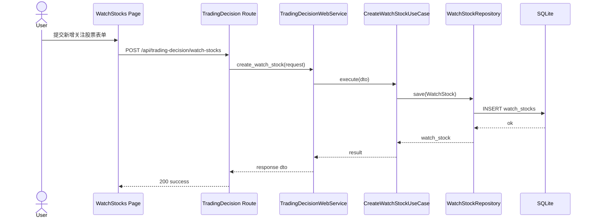

## 13.2 进场决策 AI 预填流程

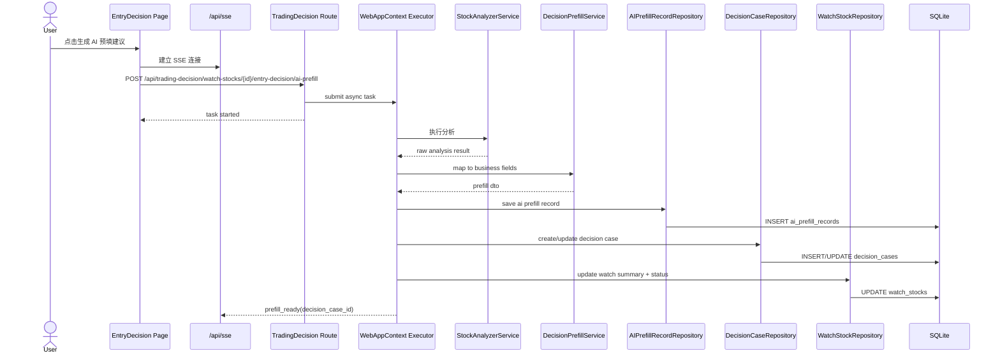

## 13.3 确认决策单并生成决策卡流程

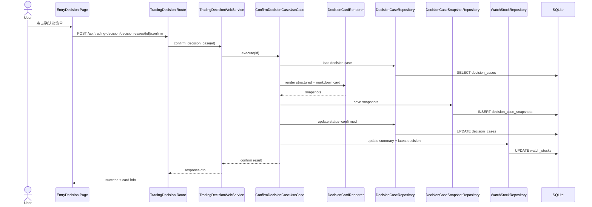

## 13.4 股票分析记录生成流程

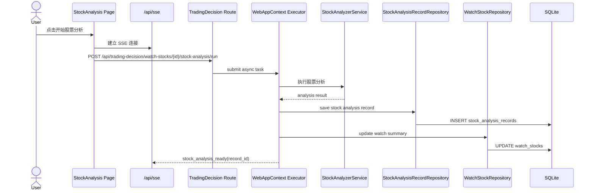

## 13.5 持仓计划分析生成流程

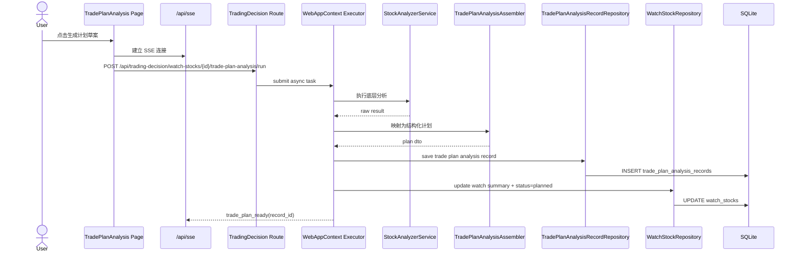

## 13.6 主页面查询与相关历史加载流程

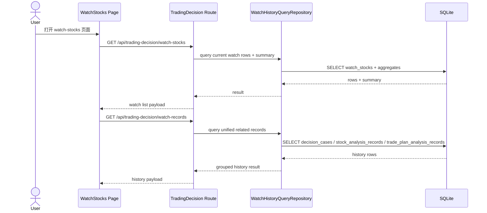

---

## 14. Query Model 与读模型设计

## 14.1 主列表读模型

主列表建议使用专门 query repository，返回：

- 关注股票当前摘要字段
- 页面统计卡 summary
- 操作入口所需 ID

不要在页面加载时从原始 AI JSON 中临时拼装。

## 14.2 子页面读模型

### Entry Decision 读模型

返回：

- 关注股票基础信息
- 当前活跃决策单或指定历史决策单
- 最近 AI 预填记录
- 历史决策记录列表

### Stock Analysis 读模型

返回：

- 当前关注股票基础信息
- 指定/最新分析记录
- 历史分析记录列表

### Trade Plan Analysis 读模型

返回：

- 当前关注股票基础信息
- 指定/最新计划记录
- 最近关联决策单
- 历史计划记录列表

## 14.3 统一历史查询模型

统一使用：

- `WatchHistoryQueryRepository`

按 `record_type` 组合查询三类记录，保证主页面 tabs 与未来独立历史页复用同一套查询逻辑。

---

## 15. 关键类职责建议

## 15.1 `TradingDecisionApplicationService`

负责：

- 组合多个 use case
- 供 web service 调用
- 对外暴露稳定服务接口

## 15.2 `DecisionPrefillService`

负责：

- 调用现有分析服务
- 归一化为决策字段
- 输出给 `DecisionCase`

## 15.3 `TradePlanAnalysisAssembler`

负责：

- 从原始分析结果提取计划结构
- 归一化为计划分析记录 DTO

## 15.4 `DecisionCardRenderer`

负责：

- 生成结构化决策卡快照
- 生成 Markdown 决策卡快照

## 15.5 `WatchStockStateMachine`

负责：

- 校验 WatchStock 合法状态流转
- 对非法流转抛出业务异常

## 15.6 `RecordSummaryService`

负责：

- 从最新业务记录更新 `WatchStock` 摘要字段
- 统一摘要生成规则

---

## 16. 页面落地建议

## 16.1 路由建议

在 `app.py` 中新增：

- `register_trading_decision_routes(app)`

逐步把以下页面从静态 `send_file(...)` 迁移为真实模板：

- `/watch-stocks`
- `/entry-decision`
- `/stock-analysis-record`
- `/trade-plan-analysis`

## 16.2 与现有路由的边界

### 保持不变

- `src/stock_analyse/interfaces/web/routes/analysis.py`
- 现有选股 / 单股分析 / 历史分析路由
- `StockAnalyzerService` 作为底层分析执行器

### 新增能力集中在

- `interfaces/web/routes/trading_decision.py`
- `interfaces/web/services/trading_decision_service.py`
- 新增 domain / repository / use_cases

### 明确避免

- 不在 `misc.py` 中堆叠交易决策业务 API
- 不在 route 中直接写 SQL
- 不把分析原始 JSON 作为业务数据库主模型

---

## 17. 实施顺序建议

### Step 1：SQLite schema + repository

先完成：

- `schema_manager.py`
- 6 张核心表
- repository 基础 CRUD
- query repository

### Step 2：trading_decision 路由与 service 骨架

完成：

- `register_trading_decision_routes(app)`
- `TradingDecisionWebService`
- `TradingDecisionApplicationService`

### Step 3：watch-stocks CRUD + 主列表查询

完成：

- 新增关注股票
- 编辑 / 归档
- 主列表 + summary 统计
- 主页面同级历史记录查询

### Step 4：entry-decision + AI prefill

完成：

- 决策单草稿创建/编辑
- AI 预填异步任务
- 决策确认与决策卡生成

### Step 5：stock-analysis-record 子流程

完成：

- 股票分析异步任务
- 结构化分析记录落库
- 历史记录查询

### Step 6：trade-plan-analysis 子流程

完成：

- 持仓计划分析异步任务
- 结构化计划记录落库
- 历史计划查询

### Step 7：页面模板接入真实 API

把静态原型页逐步切换到真实模板和真实数据。

### Step 8：测试与验收

补足：

- repository tests
- use case tests
- route/API tests
- SSE integration checks
- 状态机测试

---

## 18. 测试与验收建议

## 18.1 测试重点

必须覆盖：

1. `WatchStock` 状态流转
2. `DecisionCase` confirm/reject 规则
3. repository CRUD 与排序
4. AI 预填字段映射
5. 决策卡快照生成
6. 主列表筛选查询
7. 异步任务先落库后发 SSE ready 事件

## 18.2 API 验收要点

### watch-stocks

- 可创建、更新、归档
- 可按市场/状态/阶段筛选

### entry-decision

- AI 预填可异步返回
- 草稿可保存
- 确认后能生成 card snapshot

### stock-analysis-record

- 可生成并保存结构化记录
- 可按时间 / 类型查询历史

### trade-plan-analysis

- 可生成并保存结构化计划记录
- 可按风险等级等条件查询历史

---

## 19. 风险与后续扩展

## 19.1 当前风险

1. SQLite 并发写入能力有限
2. 现有分析服务的原始返回结构可能存在字段波动
3. watch-stocks 页面与持仓股票列表的跨域流转尚未正式落地

## 19.2 规避方式

1. 通过 repository 层隔离数据库实现，便于未来迁移
2. 通过 `DecisionPrefillService` / `TradePlanAnalysisAssembler` 做字段适配
3. 先完成 watch-stocks 闭环，再扩展到 holding-stocks

## 19.3 后续扩展方向

1. 从 `planned` 状态平滑转入持仓域
2. 将决策卡与复盘系统打通
3. 支持 portfolio-review 汇总分析
4. 如未来需要，可将 SQLite 平滑迁移到 MySQL

---

## 20. 最终结论

推荐方案是：

- 在当前 Flask 项目中新增 `trading_decision` 业务子域
- 以 `WatchStock` 作为聚合根
- 将进场决策、股票分析、持仓计划分析都设计为 append-only 历史记录
- 主列表保存当前摘要、子记录保存事实历史
- 使用 SQLite 存储结构化业务数据
- 通过适配层复用现有 `StockAnalyzerService` 和 SSE 能力
- 仅对长耗时 AI 动作使用异步 + SSE，其余 CRUD 与确认动作走同步事务

该方案与当前代码架构兼容，能覆盖业务方案与 UI 原型要求，并为后续从关注池扩展到持仓域提供稳定基础。